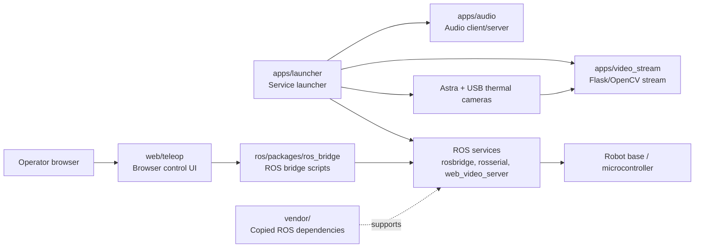

# ROS Telepresence Service Robot

Archived ROS-based service robot prototype with web video streaming, remote browser control, audio streaming, ROS bridge support, serial communication, and thermal camera launch files.

The project was originally built during the COVID-era service robot period. It is kept as a reference for the robot control architecture and integration experiments rather than as production-ready robotics software.


## Features

- Tkinter launcher for starting and stopping robot services
- ROS web video streaming through `web_video_server`
- Astra camera and USB thermal camera launch commands
- ROS bridge websocket startup
- ROS serial startup for microcontroller communication
- Browser-based teleoperation UI
- Simple socket-based audio client/server prototype
- Separate Windows and Ubuntu experiment folders

## Architecture



## Repository Layout

```text
ros-telepresence-service-robot/
  apps/
    launcher/
    audio/
    video_stream/
      ubuntu/
      windows/
  config/
  ros/
    launch/
    packages/
  vendor/
  web/
    teleop/
```

- `apps/launcher/` - Legacy Python 2 Tkinter launcher for starting and stopping robot services.
- `apps/audio/` - Socket-based audio client/server prototype.
- `apps/video_stream/` - Flask/OpenCV camera streaming experiments, split into `ubuntu/` and `windows/` variants.
- `web/teleop/` - Browser UI for robot video and teleoperation.
- `ros/packages/ros_bridge/` - ROS package with bridge/listener/talker scripts.
- `ros/launch/` - Custom launch files owned by this project.
- `vendor/` - Third-party or copied ROS packages kept for historical reproducibility.
- `config/` - Example robot configuration.

## Requirements

- ROS Kinetic-era environment
- Python 2 for the legacy `apps/launcher/main.py`
- Python 3 for the `apps/video_stream/ubuntu/` and `apps/video_stream/windows/` Flask experiments
- Astra camera ROS package
- `rosbridge_server`
- `rosserial_python`
- `web_video_server`
- USB camera support
- Python packages listed in `requirements.txt`

Install Python packages for the Flask/audio/video experiments:

```bash
pip install -r requirements.txt
```

## Configuration

The launcher reads `config/robot.local.json` when it exists, otherwise it falls back to `config/robot.example.json`:

```json
{
  "robotIp": "192.168.1.10"
}
```

Create a local config when running the launcher:

```bash
cp config/robot.example.json config/robot.local.json
```

Then update `robotIp` to match the robot or remote computer on your network. `robot.local.json` is ignored by Git.

## Legacy Launcher

From a ROS environment:

```bash
python2 apps/launcher/main.py
```

The launcher starts these commands:

```text
rosrun web_video_server web_video_server
roslaunch astra_camera astra.launch
roslaunch rosbridge_server rosbridge_websocket.launch
rosrun rosserial_python serial_node.py /dev/ttyACM0
roslaunch ros/launch/thermal_cam.launch
python apps/audio/server.py
python apps/audio/client.py <robot-ip>
```

## Notes

- This repository is archived and kept for historical/reference value.
- Several ROS packages are vendored directly in the repository. For a production project, use proper ROS package dependencies or submodules instead.
- The code targets an older ROS/Python environment and may need updates for modern ROS Noetic/ROS 2 setups.
- No real network credentials are stored in this repository.

## Author

Alireza Ahmadi
